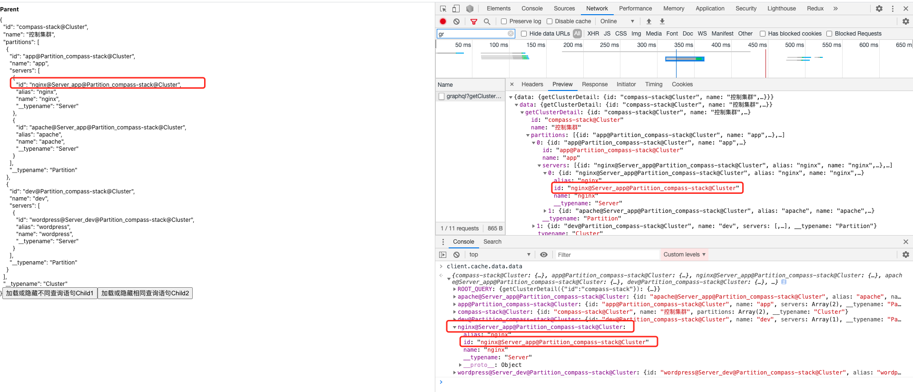
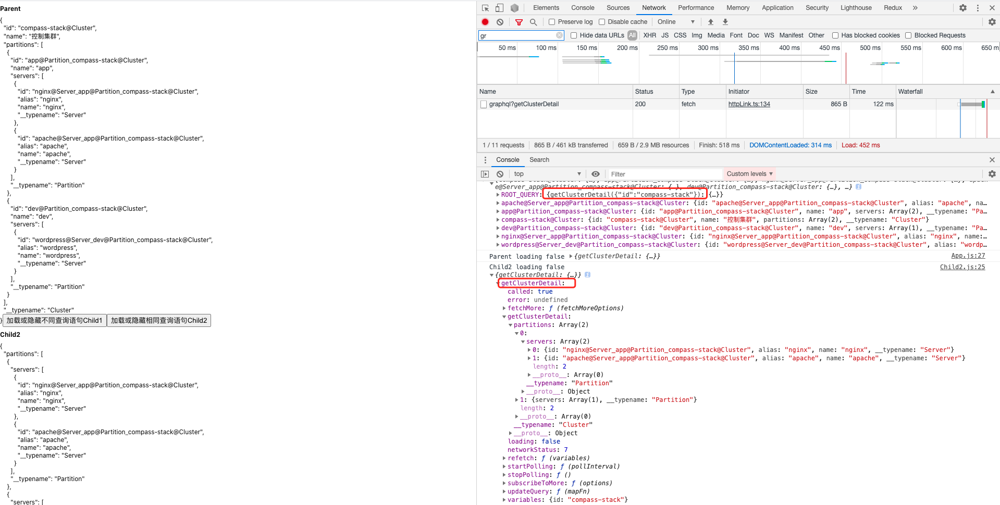
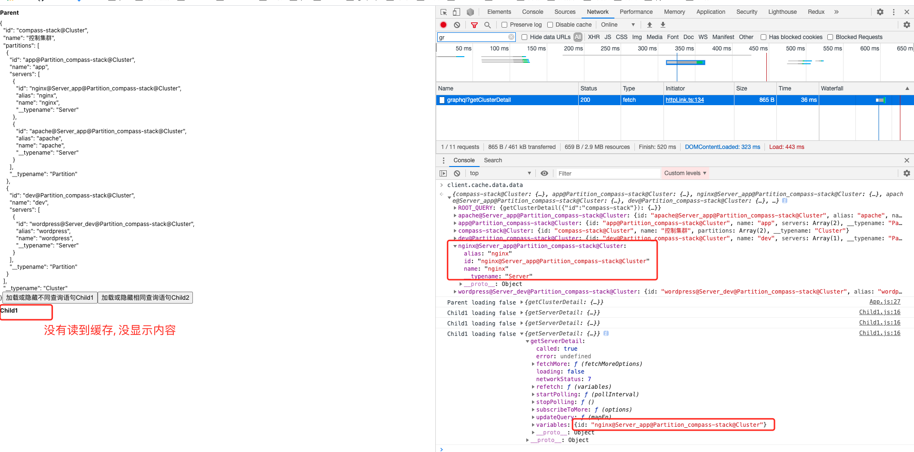

## 运行项目:
### `yarn`
### `yarn start`
### `yarn server`
---

#### 项目目的: 验证 Graphql 缓存能否命中相同 cache key 的子资源
#### 条件: 不同组件查询相同的资源
#### 结果
- Parent 组件语句中, 资源 nginx 的 cache key `nginx@Server_app@Partition_compass-stack@Cluster` 作为根缓存挂在了 Graphql 缓存上

- Child2 组件查询相同 name 的语句, 请求相同的 nginx 资源, Child2 可以取到 Parent 的缓存

- Child1 组件查询不同 name 的语句, 请求相同的 nginx 资源, Child1 取不到 Parent 的缓存

### 结论: Graphql 缓存默认是以查询语句 + 参数是否一致来判断是否命中缓存, 是以语句粒度来命中的, 不能以资源粒度命中